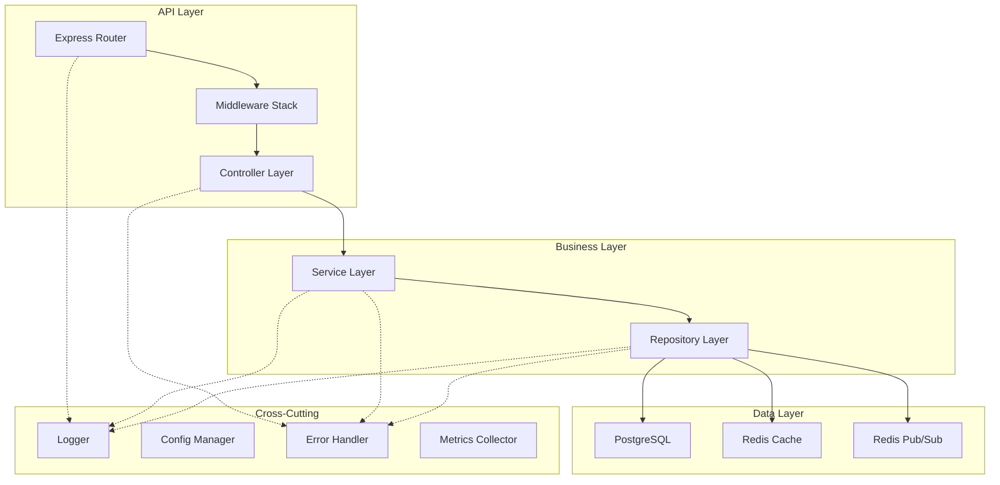

# Design Document

## Overview

This design outlines a production-ready Express.js TypeScript boilerplate specifically tailored for blockchain event processing microservices. The architecture follows modern Node.js best practices for 2025, incorporating clean architecture principles, dependency injection, and comprehensive observability.

The boilerplate provides a solid foundation with Redis caching, PostgreSQL persistence, versioned APIs with authentication, and deployment-ready configurations while remaining flexible enough to accommodate various blockchain integration patterns.

## Architecture

### High-Level Architecture



### Layered Architecture Pattern

The application follows a clean layered architecture:

1. **API Layer**: Express routes, middleware, and controllers
2. **Business Layer**: Services containing business logic
3. **Data Layer**: Prisma ORM for type-safe database operations
4. **Infrastructure Layer**: External service integrations (Redis, PostgreSQL)

## Project Structure and Conventions

### Directory Structure

```
project-root/
├── src/
│   ├── api/
│   │   ├── controllers/          # HTTP request handlers
│   │   ├── middleware/           # Express middleware functions
│   │   ├── routes/              # Route definitions and mounting
│   │   └── validators/          # Input validation schemas
│   ├── services/                # Business logic layer
│   ├── config/                  # Configuration management
│   ├── utils/                   # Utility functions and helpers
│   └── types/                   # TypeScript type definitions
├── prisma/
│   ├── schema.prisma           # Database schema definition
│   ├── migrations/             # Database migration files
│   └── seed.ts                 # Database seeding script
├── docs/
│   ├── api/                    # OpenAPI/Swagger documentation
│   │   ├── v1/                 # Version 1 API specs
│   │   │   ├── openapi.yaml    # Main OpenAPI specification
│   │   │   ├── components/     # Reusable components
│   │   │   │   ├── schemas/    # Data models and schemas
│   │   │   │   ├── responses/  # Response definitions
│   │   │   │   └── parameters/ # Parameter definitions
│   │   │   └── paths/          # Endpoint definitions
│   │   │       ├── users.yaml  # User-related endpoints
│   │   │       └── auth.yaml   # Authentication endpoints
│   │   └── v2/                 # Version 2 API specs (future)
│   └── README.md               # API documentation overview
├── scripts/                    # Build and deployment scripts
├── .env.example               # Environment variables template
├── docker-compose.yml         # Local development setup
└── Dockerfile                 # Container configuration
```

### Naming Conventions

#### Files and Directories

-   **Files**: Use kebab-case for all file names (`user-service.ts`, `auth-middleware.ts`)
-   **Directories**: Use kebab-case for directory names (`user-management/`, `api-keys/`)

-   **Type Files**: Suffix with `.types.ts` for shared types (`api.types.ts`)
-   **Documentation Files**: Use kebab-case YAML files (`users.yaml`, `auth.yaml`)
-   **OpenAPI Files**: Organize by version and resource (`docs/api/v1/paths/users.yaml`)

#### Code Conventions

-   **Classes**: PascalCase (`UserService`, `AuthController`)
-   **Interfaces**: PascalCase with descriptive names (`UserCreateRequest`, `ApiResponse`)
-   **Functions**: camelCase with verb-noun pattern (`createUser`, `validateToken`)
-   **Variables**: camelCase (`userId`, `authToken`)
-   **Constants**: SCREAMING_SNAKE_CASE (`MAX_RETRY_ATTEMPTS`, `DEFAULT_CACHE_TTL`)
-   **Enums**: PascalCase with descriptive values (`UserRole.ADMIN`, `EventType.USER_CREATED`)

#### API Conventions

-   **Endpoints**: RESTful with kebab-case (`/api/v1/users`, `/api/v1/api-keys`)
-   **HTTP Methods**: Follow REST conventions (GET, POST, PUT, DELETE, PATCH)
-   **Response Fields**: camelCase in JSON responses (`userId`, `createdAt`)
-   **Query Parameters**: camelCase (`?sortBy=createdAt&orderBy=desc`)
-   **Documentation**: Modular OpenAPI YAML files organized by version and resource
-   **API Docs Route**: Interactive documentation available at `/api-docs`

#### Database Conventions

-   **Table Names**: snake_case plural (`users`, `api_keys`, `user_roles`)
-   **Column Names**: snake_case (`user_id`, `created_at`, `is_active`)
-   **Foreign Keys**: `{table}_id` pattern (`user_id`, `api_key_id`)
-   **Indexes**: Descriptive names (`idx_users_email`, `idx_api_keys_user_id`)

### Development Habits and Patterns

#### Error Handling Patterns

```typescript
// Use custom error classes with proper inheritance
class ValidationError extends Error {
	constructor(message: string, public field: string) {
		super(message);
		this.name = "ValidationError";
	}
}

// Always include error context
throw new ValidationError("Email is required", "email");
```

#### Logging Patterns

```typescript
// Use structured logging with context
logger.info("User created successfully", {
	userId: user.id,
	email: user.email,
	requestId: req.id,
});

// Include correlation IDs for tracing
logger.error("Database connection failed", {
	error: error.message,
	requestId: req.id,
	operation: "user.create",
});
```

#### Configuration Patterns

```typescript
// Group related configuration
interface DatabaseConfig {
	url: string;
	maxConnections: number;
	timeout: number;
}

// Use environment-specific defaults
const config = {
	database: {
		url: process.env.DATABASE_URL || "postgresql://localhost:5432/app",
		maxConnections: parseInt(process.env.DB_MAX_CONNECTIONS || "10"),
		timeout: parseInt(process.env.DB_TIMEOUT || "30000"),
	},
};
```

#### Dependency Injection Pattern

We'll use a lightweight manual dependency injection approach without external DI containers for simplicity and transparency:

```typescript
// Container interface for type safety
interface ServiceContainer {
	prisma: PrismaClient;
	redis: Redis;
	logger: Logger;
	config: AppConfig;
	cacheService: CacheService;
	userService: UserService;
	authService: AuthService;
}

// Service factory pattern
class ServiceFactory {
	private static instance: ServiceContainer;

	static async create(): Promise<ServiceContainer> {
		if (!this.instance) {
			const config = loadConfig();
			const logger = createLogger(config.logging);
			const prisma = new PrismaClient();
			const redis = new Redis(config.redis);

			const cacheService = new CacheService(redis, logger);
			const userService = new UserService(prisma, cacheService, logger);
			const authService = new AuthService(
				userService,
				config.auth,
				logger
			);

			this.instance = {
				prisma,
				redis,
				logger,
				config,
				cacheService,
				userService,
				authService,
			};
		}
		return this.instance;
	}

	static getInstance(): ServiceContainer {
		if (!this.instance) {
			throw new Error(
				"ServiceFactory not initialized. Call create() first."
			);
		}
		return this.instance;
	}
}

// Service layer with constructor injection
class UserService {
	constructor(
		private prisma: PrismaClient,
		private cache: CacheService,
		private logger: Logger
	) {}

	async createUser(data: CreateUserRequest): Promise<User> {
		this.logger.info("Creating user", { email: data.email });
		// Implementation with proper error handling
	}
}

// Controller with service injection
class UserController {
	constructor(private userService: UserService) {}

	async create(req: Request, res: Response): Promise<void> {
		const user = await this.userService.createUser(req.body);
		res.status(201).json(user);
	}
}
```

#### Validation Patterns

```typescript
// Use Joi for consistent validation
const createUserSchema = Joi.object({
	email: Joi.string().email().required(),
	password: Joi.string().min(8).required(),
	roles: Joi.array()
		.items(Joi.string().valid("USER", "ADMIN"))
		.default(["USER"]),
});
```

## Components and Interfaces

### Key Components

#### 1. Application Bootstrap (`src/app.ts`)

-   Express application factory
-   Middleware registration
-   Route mounting
-   Error handling setup
-   Swagger UI integration
-   Graceful shutdown handling

#### 2. Configuration Management (`src/config/`)

-   Environment variable validation using Joi
-   Type-safe configuration objects
-   Database connection configurations
-   Redis connection settings
-   JWT and API key configurations

#### 3. Database Layer (`src/prisma/`)

-   Prisma ORM integration with type-safe queries
-   Prisma Client singleton pattern
-   Database schema definitions
-   Migration management through Prisma Migrate
-   Seed scripts for development data

#### 4. Cache Layer (`src/services/cache/`)

-   Redis connection management
-   TTL-based caching strategies
-   Pub/Sub message handling
-   Cache invalidation patterns
-   Fallback mechanisms

#### 5. Authentication & Authorization (`src/api/middleware/auth/`)

-   JWT token validation
-   API key authentication
-   Role-based access control
-   Rate limiting per user/key
-   Service-to-service authentication

#### 6. API Versioning (`src/api/routes/`)

-   Version-specific route handlers
-   Backward compatibility support
-   API deprecation strategies
-   Route-to-documentation mapping

#### 7. API Documentation (`docs/api/`)

-   Modular OpenAPI YAML specifications
-   Version-specific documentation structure
-   Reusable components and schemas
-   Interactive Swagger UI interface
-   Authentication examples and security schemes

## Data Models

### Core Entity Interfaces

```typescript
// Base entity with common fields
interface BaseEntity {
	id: string;
	createdAt: Date;
	updatedAt: Date;
}

// User entity for authentication
interface User extends BaseEntity {
	email: string;
	hashedPassword?: string;
	apiKeys: ApiKey[];
	roles: UserRole[];
	isActive: boolean;
}

// API Key for external access
interface ApiKey extends BaseEntity {
	keyId: string;
	hashedKey: string;
	userId: string;
	permissions: Permission[];
	rateLimit: RateLimitConfig;
	expiresAt?: Date;
}

// Configuration for different environments
interface AppConfig {
	server: ServerConfig;
	database: DatabaseConfig;
	redis: RedisConfig;
	auth: AuthConfig;
	logging: LoggingConfig;
}
```

### Prisma Schema Design

#### Prisma Schema Definition

```prisma
// prisma/schema.prisma
generator client {
    provider = "prisma-client-js"
}

datasource db {
    provider = "postgresql"
    url      = env("DATABASE_URL")
}

model User {
    id             String   @id @default(cuid())
    email          String   @unique
    hashedPassword String?  @map("hashed_password")
    isActive       Boolean  @default(true) @map("is_active")
    createdAt      DateTime @default(now()) @map("created_at")
    updatedAt      DateTime @updatedAt @map("updated_at")

    apiKeys        ApiKey[]
    userRoles      UserRole[]

    @@map("users")
}

model ApiKey {
    id          String    @id @default(cuid())
    keyId       String    @unique @map("key_id")
    hashedKey   String    @map("hashed_key")
    userId      String    @map("user_id")
    permissions Json      @default("[]")
    rateLimit   Json      @default("{}") @map("rate_limit")
    expiresAt   DateTime? @map("expires_at")
    createdAt   DateTime  @default(now()) @map("created_at")
    updatedAt   DateTime  @updatedAt @map("updated_at")

    user        User      @relation(fields: [userId], references: [id], onDelete: Cascade)

    @@map("api_keys")
}

model UserRole {
    id        String   @id @default(cuid())
    userId    String   @map("user_id")
    role      String
    createdAt DateTime @default(now()) @map("created_at")

    user      User     @relation(fields: [userId], references: [id], onDelete: Cascade)

    @@unique([userId, role])
    @@map("user_roles")
}
```

### Redis Data Patterns

#### Cache Keys Structure

```
cache:{entity}:{id} - Individual entity cache
cache:{entity}:list:{filter_hash} - List cache with filters
session:{user_id} - User session data
rate_limit:{key_id}:{window} - Rate limiting counters
```

#### Pub/Sub Channels

```
events:{event_type} - Specific event type notifications
notifications:{user_id} - User-specific notifications
system:health - System health updates
```

## Error Handling

### Error Classification

1. **Validation Errors** (400): Input validation failures
2. **Authentication Errors** (401): Invalid credentials or tokens
3. **Authorization Errors** (403): Insufficient permissions
4. **Not Found Errors** (404): Resource not found
5. **Rate Limit Errors** (429): Rate limit exceeded
6. **Server Errors** (500): Internal application errors
7. **Service Unavailable** (503): External service failures

### Error Response Format

```typescript
interface ErrorResponse {
	error: {
		code: string;
		message: string;
		details?: any;
		timestamp: string;
		requestId: string;
	};
}
```

### Error Handling Middleware

```typescript
interface CustomError extends Error {
	statusCode: number;
	code: string;
	details?: any;
}

// Centralized error handler
const errorHandler = (
	error: CustomError,
	req: Request,
	res: Response,
	next: NextFunction
) => {
	// Log error with context
	// Format error response
	// Send appropriate HTTP status
};
```

## Security Considerations

### Authentication & Authorization

-   JWT tokens with configurable expiration
-   API key authentication for external services
-   Role-based access control (RBAC)
-   Service-to-service authentication using shared secrets

### Input Validation & Sanitization

-   Joi schema validation for all inputs
-   SQL injection prevention through parameterized queries
-   XSS protection through input sanitization
-   Request size limits and timeout configurations

### Security Headers & Middleware

-   Helmet.js for security headers
-   CORS configuration with whitelist
-   Rate limiting with Redis-backed storage
-   Request logging for audit trails

### Secrets Management

-   Environment variable validation
-   Secure configuration loading
-   API key hashing using bcrypt
-   Database connection string encryption

## Performance Optimization

### Caching Strategy

-   Redis-based application cache with TTL
-   Database query result caching
-   API response caching for read-heavy endpoints
-   Cache invalidation on data updates

### Database Optimization

-   Connection pooling with configurable limits
-   Database indexing strategy
-   Query optimization and monitoring
-   Read replica support for scaling

### Monitoring & Observability

-   Prometheus metrics collection
-   Structured logging with correlation IDs
-   Health check endpoints for dependencies
-   Performance monitoring and alerting

This design provides a robust foundation for blockchain event processing microservices while maintaining flexibility for specific use case implementations.
